::::::::::::::::::::::::::::::::::::::: objectives

- Create a local Git repository.
- Describe the purpose of the `.git` directory.

::::::::::::::::::::::::::::::::::::::::::::::::::

:::::::::::::::::::::::::::::::::::::::: questions

- Where does Git store information?

::::::::::::::::::::::::::::::::::::::::::::::::::

Once Git is configured,
we can start using it.

We will help Alfredo with his new project, create a repository with all his recipes.

First, let's create a new directory in the `Desktop` folder for our work:

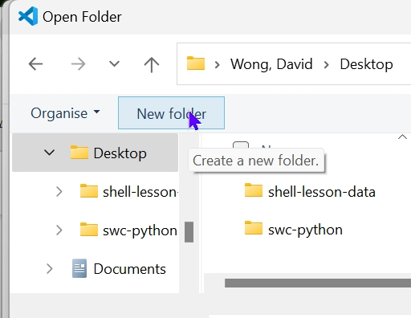

We then open this newly created folder in VS Code by clicking `Open Folder`:

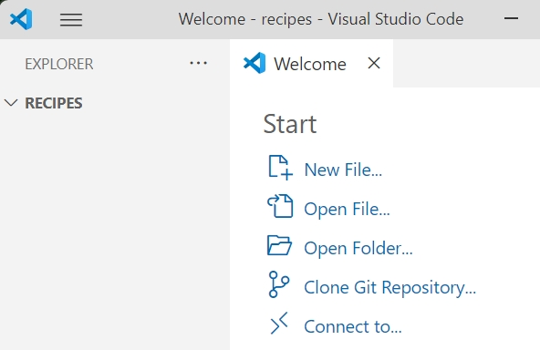

and then selecting the `recipes` folder:

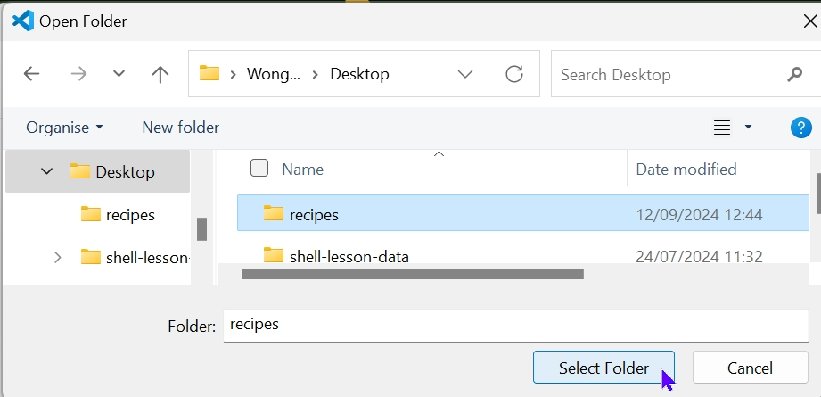

Then we tell Git to make `recipes` a [repository](../learners/reference.md#repository)
\-- a place where Git can store versions of our files. Click menu `View` and then `Source Control`:

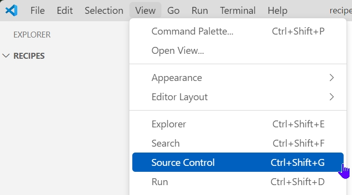

Click `Initialize Repository`:

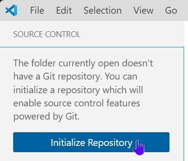

and you will see `Source Control` which means the repository is created. 

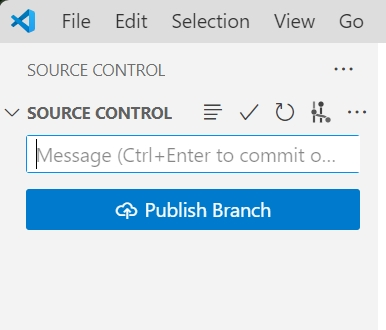

It is important to note that `Initialize Repository` will create a repository that
can include subdirectories and their files---there is no need to create
separate repositories nested within the `recipes` repository, whether
subdirectories are present from the beginning or added later. Also, note
that the creation of the `recipes` directory and its initialization as a
repository are completely separate processes.

If we view the repository in its folder, it appears that nothing has changed since there is no visible content. To see what changed, click `View` in the folder:

and choose `Show` and `hidden items`. We can see that Git has created a hidden directory within `recipes` called `.git`:

Git uses this special subdirectory to store all the information about the project,
including the tracked files and sub-directories located within the project's directory.
If we ever delete the `.git` subdirectory,
we will lose the project's history.

Next, we will change the default branch to be called `main`.
This might be the default branch depending on your settings and version
of git. 
See the [setup episode](02-setup.md#default-git-branch-naming) for more information on this change.

To see branch name, ensure that `Source Control Repositories` is selected. As shown below, the branch is called "project".

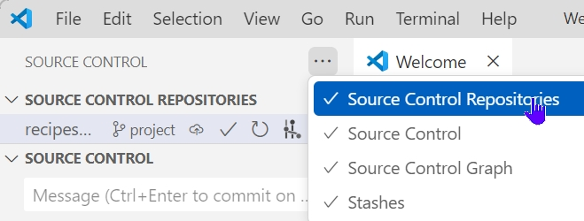

Under `Source Control Repositories`, click on the three dots of our repository `recipes`, and select `Rename Branch`:

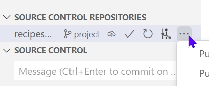

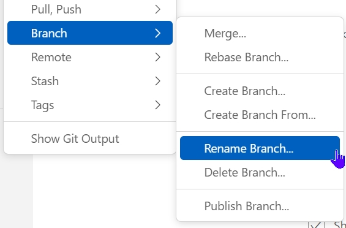

Enter "main" and press Return to save. The branch is renamed to `main`:

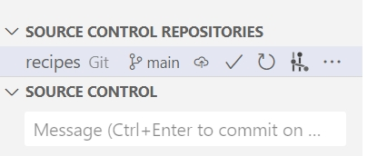

We can now start using one of the most important git commands, which is particularly helpful to beginners. In the screenshot above, in the `Source Control` window, is a blue button. It will show a different command depending on the status of our repository. Under this button we will find what changes have been made in the repository and the status of this change. The information here is updated as we make changes to our repository. We will see more examples of this later. For now, remember that this `Source Control` window tells us the status of our project, and better, a list of changes in the project and options on what to do with those changes. We can refer to it as often as we want, whenever we want to understand what is going on.

:::::::::::::::::::::::::::::::::::::::  challenge

## Places to Create Git Repositories

Along with tracking information about recipes (the project we have already created),
Alfredo would also like to track information about desserts specifically.
Alfredo creates a `desserts` project inside his `recipes`
project. Is it a good idea to have a repository for tracking files stored in the `desserts` subdirectory?

To create the repository for `dessert`, Alfredo selects this folder in VSCode, as shown below:

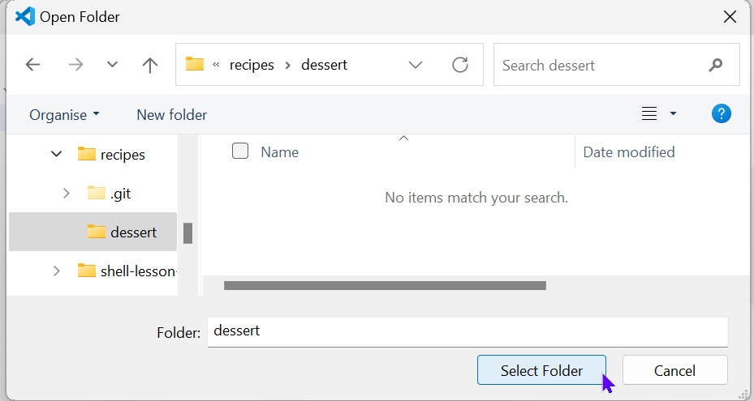

However, VS Code tells Alfredo there is an error in one or two messages:

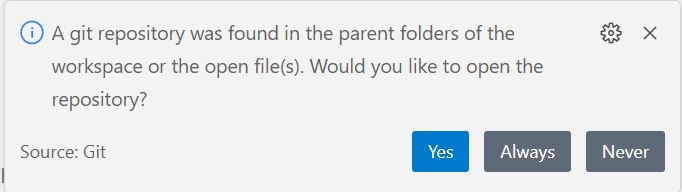

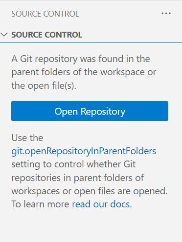

Alredo explores further using the `Open Repository` button and it looks like Alfredo cannot create this repository:

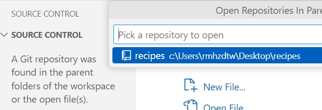

What should Alfredo do?

:::::::::::::::  solution

## Solution

No. Alfredo does not need to make the `desserts` subdirectory a Git repository
because the `recipes` repository will track all files, sub-directories, and
subdirectory files under the `recipes` directory.  Thus, in order to track
all information about desserts, Alfredo only needed to add the `desserts` subdirectory
to the `recipes` directory.

Additionally, Git repositories can interfere with each other if they are "nested":
the outer repository will try to version-control
the inner repository. Therefore, it's best to create each new Git
repository in a separate directory. To be sure that there is no conflicting
repository in the directory, check the output of `git status`.

:::::::::::::::::::::::::

## Correcting Initialize Repository Mistakes

Alfredo has managed to create the `dessert` repository inside `recipes`. Jimmy explains to Alfredo how such a nested repository is redundant and may cause confusion
down the road. Alfredo would like to go back to a single git repository. How can Alfredo undo
his last Initialize Repository in the `desserts` subdirectory?

:::::::::::::::  solution

## Solution -- USE WITH CAUTION!

### Background

Removing files from a Git repository needs to be done with caution. But we have not learned
yet how to tell Git to track a particular file; we will learn this in the next episode. Files
that are not tracked by Git can easily be removed like any other "ordinary" files by deleting them in VSCode Explorer.

Similarly a directory can be removed in the same way in Explorer.
If the files or folder being removed in this fashion are tracked by Git, then their removal
becomes another change that we will need to track, as we will see in the next episode.

### Solution

Git keeps all of its files in the `.git` directory.
To recover from this little mistake, Alfredo can remove the `.git`
folder in the desserts subdirectory by deleting the `.git` directory.

But be careful! Running this command in the wrong directory will remove
the entire Git history of a project you might want to keep.
Further, although the deleted files and directories might be in the Recycle bin which can be recovered, we should not rely on this. Also the "Undo" command in VSCode does not always work to revert a delete command.
Therefore, always check your current directory.

:::::::::::::::::::::::::

::::::::::::::::::::::::::::::::::::::::::::::::::

:::::::::::::::::::::::::::::::::::::::: keypoints

- `Initialize Repository` sets up a new repository.
- Git stores all of its repository data in the `.git` directory.

::::::::::::::::::::::::::::::::::::::::::::::::::
