::::::::::::::::::::::::::::::::::::::: objectives

- Explain what the HEAD of a repository is and how to use it.
- Identify and use Git commit numbers.
- Compare various versions of tracked files.
- Restore old versions of files.

::::::::::::::::::::::::::::::::::::::::::::::::::

:::::::::::::::::::::::::::::::::::::::: questions

- How can I identify old versions of files?
- How do I review my changes?
- How can I recover old versions of files?

::::::::::::::::::::::::::::::::::::::::::::::::::

As we saw in the previous episode, we can refer to commits using Git Graph.  By default, Git Graph refers to the *most recent commit* of the working directory.

We've been adding small changes at a time to `guacamole.md`, so it's easy to track our
progress by looking, so let's do that using Git Graph.  Before we start,
let's make a change to `guacamole.md`, adding yet another line. Remember to **save** the file.

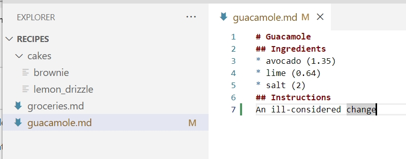

Now, let's see what we get using `View Changes` icon .

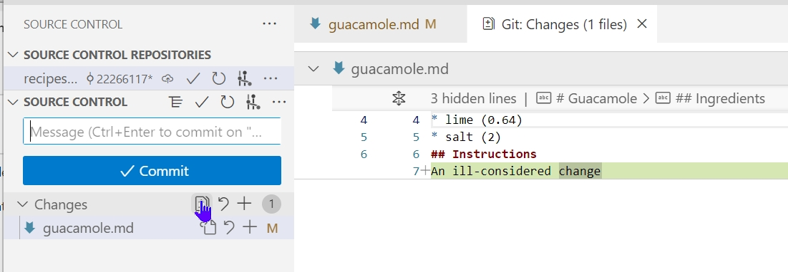

VS Code might show only the important lines with changes: see the line below the file name: "3 hidden lines", followed by headers that are hidden (`# Guacamole`, `## Ingredients`)

Click over the "3 hidden lines" (obviously, this will say a different number of hidden lines in other occasions) and the file is opened in full, clicking the two inverted arrows in line 1 will take you back to the previous format with the hidden lines:

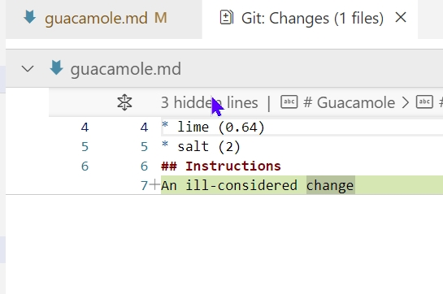 &nbsp;&nbsp;&nbsp; 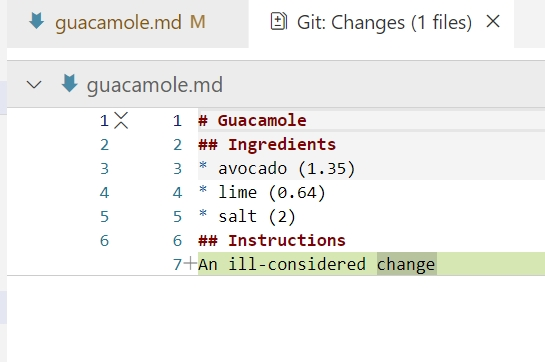

The changes shown is the same as what you would get if you use Git Graph. 

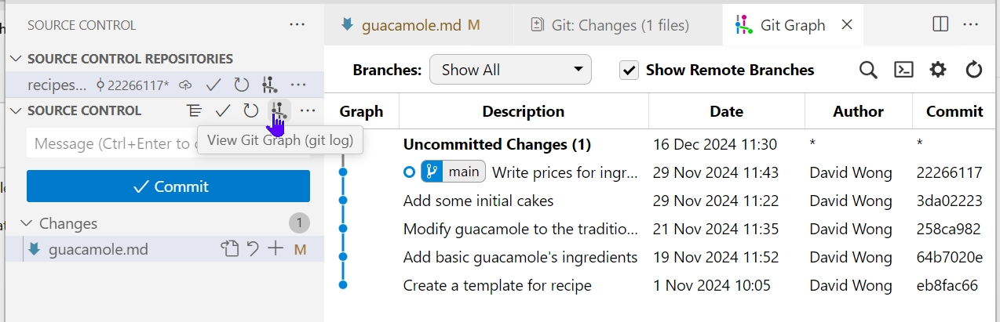

The top (most recent) entry has a description "Uncommitted Changes (1)" where the `1` indicates how many lines changed compared to the most recent commit. Click on the description "Uncommitted Changes (1)", then click on the file to view content difference between the "uncommitted changes (1)" version and the most recent commit.

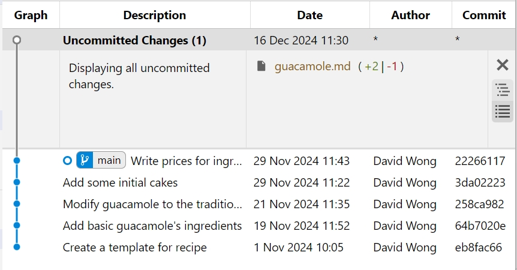
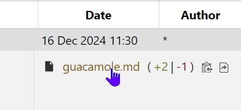

VS Code shows the difference, which is the same as the `View Changes` above.

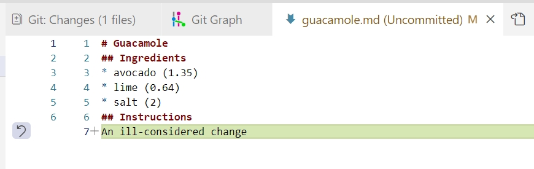

The real goodness in all this is when you can refer to previous commits. If we want to see the differences between older commits we can select do so in Git Graph. In the screenshot below, the first two entries are selected. To do multiple select, on Windows, hold down the CTRL (control) key and click the two entries; on the Mac, use the Option key.


Click on the file name `guacamole.md` and VS Code shows you the file difference between the two versions, "Uncommitted changes (1)" and the most recent change (also called the "HEAD").

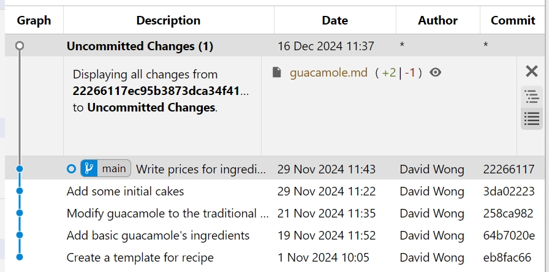 &nbsp; 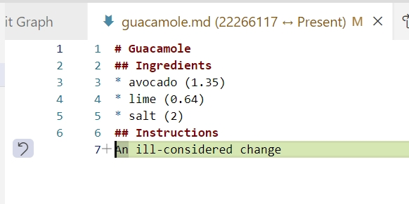

The screenshots below show comparing the "Uncommitted changes (1)" version with the one two versions back, also referred to "HEAD~1" (where "~" is "tilde", pronounced [til-duh]).

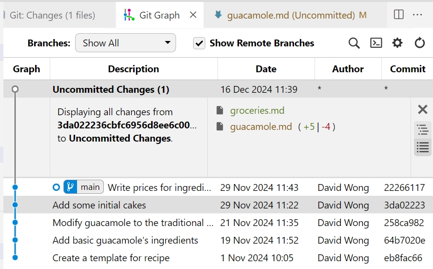 &nbsp; 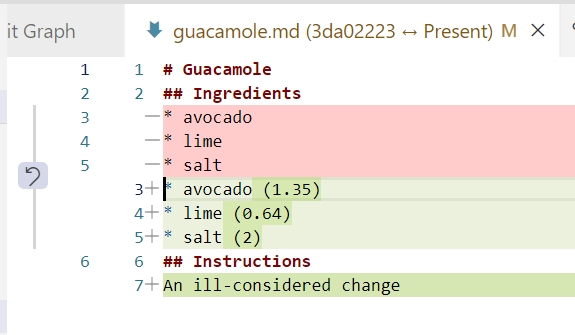

These show comparing "Uncommitted changes (1)" with "HEAD~2". Of interest here is that the list of files have changed, not the content of `guacamole.md`.

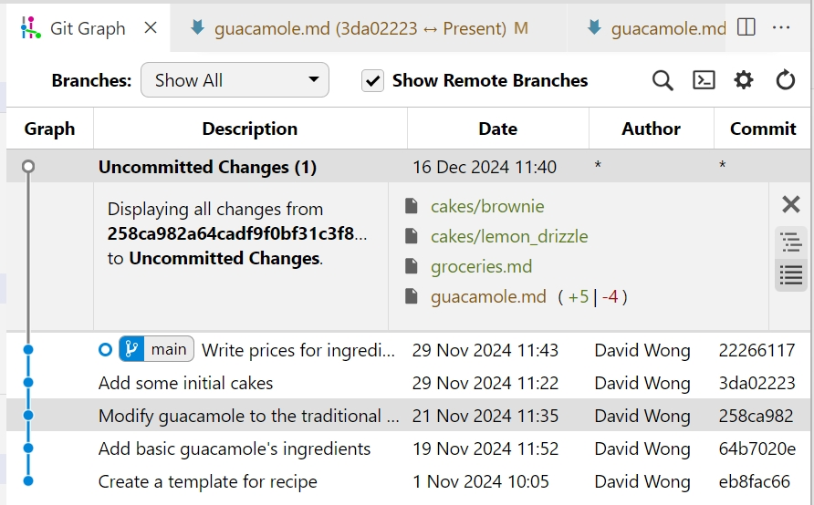 &nbsp; 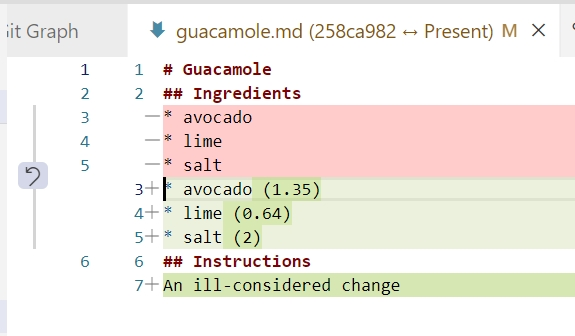

We can also use Git Graph to show us what changes we made at an older commit as
well as the commit message, rather than the *differences* between a commit and our
working directory. To do this, click on an older commit, as shown in the following screenshot which is the changes 3 versions back (or "HEAD~3")

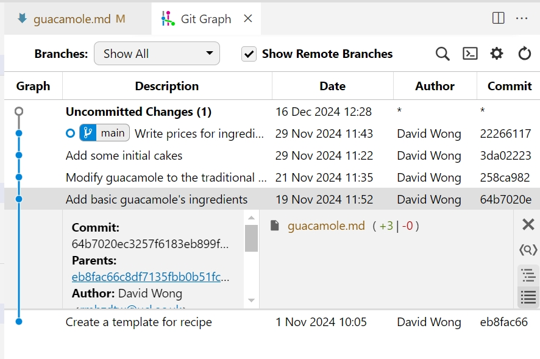 


In this way,
we can build up a chain of commits.
The most recent end of the chain is referred to as `HEAD`;
we can refer to previous commits using the `~` notation,
so `HEAD~1`
means "the previous commit",
while `HEAD~123` goes back 123 commits from where we are now.

We can also refer to commits using
those long strings of digits and letters as shown in Git Graph: in the above screenshot, HEAD~3's full commit ID is the one beginning 64b7020ec3257f6183eb...

We don't specify Commit ID directly, which means it is very important to use good commit messages for easy identification. However, commit IDs can be used for easy reference when working in a team: in that case the short version will do.


All right! So
we can save changes to files and see what we've changed. Now, how
can we restore older versions of things?
Let's suppose we change our mind about the last update to
`guacamole.md` (the "ill-considered change"). We can use `checkout` to revert to the most recent commit. In Git Graph, right-click on the most recent commit entry, and choose `Checkout...` from the drop-down menu. In the pop-up message, it warns that this "will result in a 'detached HEAD' state". This is explained [later](#don't-lose-your-head).

To maintain "HEAD" for the checkout, we can use `stash` to save the current changes for later use, and we will be returned to the last commit version of the working directory. To do this, right click on the "Uncommitted changes (1)" item and choose "Stash uncommitted changes". The stashed version is shown in Git Graph. The following screenshots show the stash entry, but HEAD is at the most recent commit, and there are no changes in the working directory.

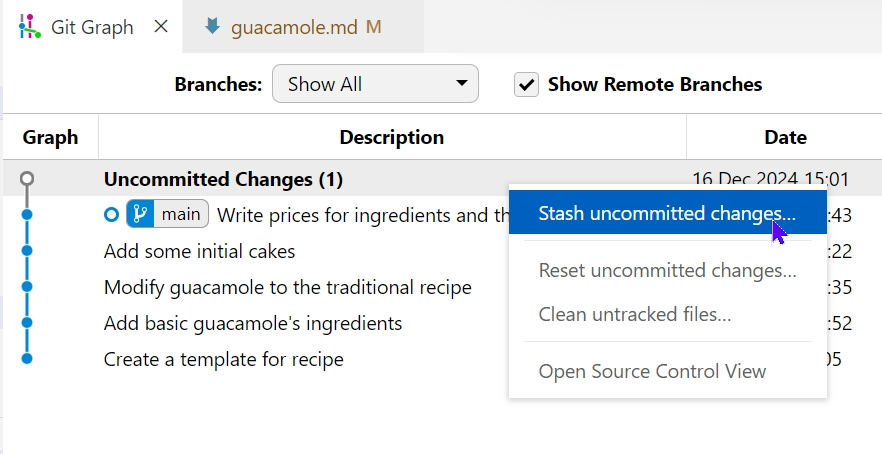
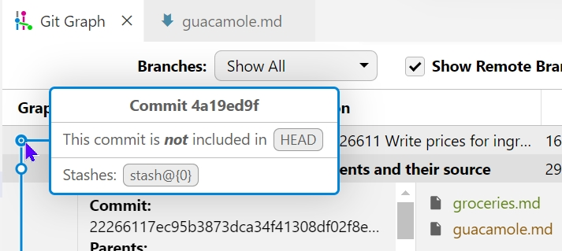 

Note that the `checkout` operates on a commit entry, not individual file from that commit. 

We can use `checkout` to retrieve content from any other commit. However, note that the whole working directory will be changed to the version from the commit entry.

:::::::::::::::::::::::::::::::::::::::::  callout

## Don't Lose Your HEAD

Above we used `checkout` to revert `guacamole.md` to its state after the commit `22266117`. But be careful because this leads to a "detached HEAD" state. Git's manual says that while in this state, you can look around, make experimental
changes and commit them, and you can discard any commits you make in this
state without impacting any branches by performing another checkout.

The "detached HEAD" is like "look, but don't touch" here,
so you shouldn't make any changes in this state.
After investigating your repo's past state, reattach your `HEAD` on the most recent entry: right-click on it and choose checkout.


::::::::::::::::::::::::::::::::::::::::::::::::::

It's important to remember that
we must use the commit number that identifies the state of the repository
*before* the change we're trying to undo.
A common mistake is to use the number of
the commit in which we made the change we're trying to discard.
In the example below, we want to retrieve the state from before the most
recent commit (`HEAD~1`), (`f22b25e` in this example):


So, to put it all together,
here's how Git works in cartoon form:

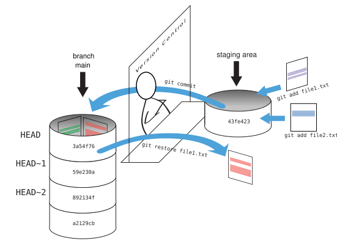

:::::::::::::::::::::::::::::::::::::::::  callout


<hr />
<hr />
<hr />

## Recovering Older Versions of a File --- we need a revised exercise

Jennifer has made changes to the Python script that she has been working on for weeks, and the
modifications she made this morning "broke" the script and it no longer runs. She has spent
\~ 1hr trying to fix it, with no luck...

Luckily, she has been keeping track of her project's versions using Git! Which commands below will
let her recover the last committed version of her Python script called
`data_cruncher.py`?

1. `$ git checkout HEAD`

2. `$ git checkout HEAD data_cruncher.py`

3. `$ git checkout HEAD~1 data_cruncher.py`

4. `$ git checkout <unique ID of last commit> data_cruncher.py`

5. Both 2 and 4

:::::::::::::::  solution

## Solution

The answer is (5)-Both 2 and 4.

The `checkout` command restores files from the repository, overwriting the files in your working
directory. Answers 2 and 4 both restore the *latest* version *in the repository* of the file
`data_cruncher.py`. Answer 2 uses `HEAD` to indicate the *latest*, whereas answer 4 uses the
unique ID of the last commit, which is what `HEAD` means.

Answer 3 gets the version of `data_cruncher.py` from the commit *before* `HEAD`, which is NOT
what we wanted.

Answer 1 can be dangerous! Without a filename, `git checkout` will restore **all files**
in the current directory (and all directories below it) to their state at the commit specified.
This command will restore `data_cruncher.py` to the latest commit version, but it will also
restore *any other files that are changed* to that version, erasing any changes you may
have made to those files!
As discussed above, you are left in a *detached* `HEAD` state, and you don't want to be there.


:::::::::::::::::::::::::

::::::::::::::::::::::::::::::::::::::::::::::::::

:::::::::::::::::::::::::::::::::::::::  challenge

## Reverting a Commit

Jennifer is collaborating with colleagues on her Python script.  She
realizes her last commit to the project's repository contained an error, and
wants to undo it.  Jennifer wants to undo correctly so everyone in the project's
repository gets the correct change. The command `git revert [erroneous commit ID]` will create a
new commit that reverses the erroneous commit.

The command `git revert` is
different from `git checkout [commit ID]` because `git checkout` returns the
files not yet committed within the local repository to a previous state, whereas `git revert`
reverses changes committed to the local and project repositories.

Below are the right steps and explanations for Jennifer to use `git revert`,
what is the missing command?

1. `________ # Look at the git history of the project to find the commit ID`

2. Copy the ID (the first few characters of the ID, e.g. 0b1d055).

3. `git revert [commit ID]`

4. Type in the new commit message.

5. Save and close

:::::::::::::::  solution

## Solution

The command `git log` lists project history with commit IDs.

The command `git show HEAD` shows changes made at the latest commit, and lists
the commit ID; however, Jennifer should double-check it is the correct commit, and no one
else has committed changes to the repository.


:::::::::::::::::::::::::

::::::::::::::::::::::::::::::::::::::::::::::::::

:::::::::::::::::::::::::::::::::::::::  challenge

## Understanding Workflow and History

What is the output of the last command in

```bash
$ cd recipes
$ echo "I like tomatos, therefore I like ketchup" > ketchup.md
$ git add ketchup.md
$ echo "ketchup enchances pasta dishes" > ketchup.md
$ git commit -m "my opinions about the red sauce"
$ git checkout HEAD ketchup.md
$ cat ketchup.md # this will print the content of ketchup.md on screen
```

1. ```output
  ketchup enchances pasta dishes
  ```
2. ```output
  I like tomatos, therefore I like ketchup
  ```
3. ```output
  I like tomatos, therefore I like ketchup
  ketchup enchances pasta dishes
  ```
4. ```output
  Error because you have changed ketchup.md without committing the changes
  ```

:::::::::::::::  solution

## Solution

The answer is 2.

The changes to the file from the second `echo` command are only applied to the working copy,
The command `git add ketchup.md` places the current version of `ketchup.md` into the staging area.
not the version in the staging area.

So, when `git commit -m "my opinions about the red sauce"` is executed,
the version of `ketchup.md` committed to the repository is the one from the staging area and
has only one line.

At this time, the working copy still has the second line (and

`git status` will show that the file is modified). However, `git checkout HEAD ketchup.md`
replaces the working copy with the most recently committed version of `ketchup.md`.
So, `cat ketchup.md` will output

```output
I like tomatos, therefore I like ketchup
```

:::::::::::::::::::::::::

::::::::::::::::::::::::::::::::::::::::::::::::::

:::::::::::::::::::::::::::::::::::::::  challenge

## Checking Understanding of `git diff`

Consider this command: `git diff HEAD~9 guacamole.md`. What do you predict this command
will do if you execute it? What happens when you do execute it? Why?

Try another command, `git diff [ID] guacamole.md`, where [ID] is replaced with
the unique identifier for your most recent commit. What do you think will happen,
and what does happen?


::::::::::::::::::::::::::::::::::::::::::::::::::

:::::::::::::::::::::::::::::::::::::::  challenge

## Getting Rid of Staged Changes

`git checkout` can be used to restore a previous commit when unstaged changes have
been made, but will it also work for changes that have been staged but not committed?
Make a change to `guacamole.md`, add that change using `git add`,
then use `git checkout` to see if you can remove your change.

:::::::::::::::  solution

## Solution

After adding a change, `git checkout` can not be used directly.
Let's look at the output of `git status`:

```output
On branch main
Changes to be committed:
  (use "git reset HEAD <file>..." to unstage)

        modified:   guacamole.md

```

Note that if you don't have the same output
you may either have forgotten to change the file,
or you have added it *and* committed it.

Using the command `git checkout -- guacamole.md` now does not give an error,
but it does not restore the file either.
Git helpfully tells us that we need to use `git reset` first
to unstage the file:

```bash
$ git reset HEAD guacamole.md
```

```output
Unstaged changes after reset:
M	guacamole.md


Now, `git status` gives us:

```bash
$ git status
```

```output
On branch main
Changes not staged for commit:
  (use "git add <file>..." to update what will be committed)
  (use "git checkout -- <file>..." to discard changes in working directory)

        modified:   guacamole.md

no changes added to commit (use "git add" and/or "git commit -a")
```

This means we can now use `git checkout` to restore the file
to the previous commit:

```bash
$ git checkout -- guacamole.md
$ git status
```

```output
On branch main
nothing to commit, working tree clean
```

:::::::::::::::::::::::::

::::::::::::::::::::::::::::::::::::::::::::::::::

:::::::::::::::::::::::::::::::::::::::  challenge

## Explore and Summarize Histories

Exploring history is an important part of Git, and often it is a challenge to find
the right commit ID, especially if the commit is from several months ago.

Imagine the `recipes` project has more than 50 files.
You would like to find a commit that modifies some specific text in `guacamole.md`.
When you type `git log`, a very long list appeared.
How can you narrow down the search?

Recall that the `git diff` command allows us to explore one specific file,
e.g., `git diff guacamole.md`. We can apply a similar idea here.

```bash
$ git log guacamole.md
```

Unfortunately some of these commit messages are very ambiguous, e.g., `update files`.
How can you search through these files?

Both `git diff` and `git log` are very useful and they summarize a different part of the history
for you.
Is it possible to combine both? Let's try the following:

```bash
$ git log --patch guacamole.md
```

You should get a long list of output, and you should be able to see both commit messages and
the difference between each commit.

Question: What does the following command do?

```bash
$ git log --patch HEAD~9 *.md
```

::::::::::::::::::::::::::::::::::::::::::::::::::

:::::::::::::::::::::::::::::::::::::::: keypoints

- `git diff` displays differences between commits.
- `git checkout` recovers old versions of files.

::::::::::::::::::::::::::::::::::::::::::::::::::
